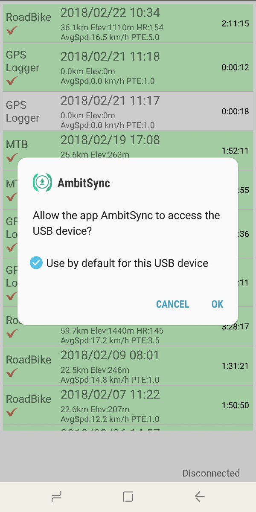
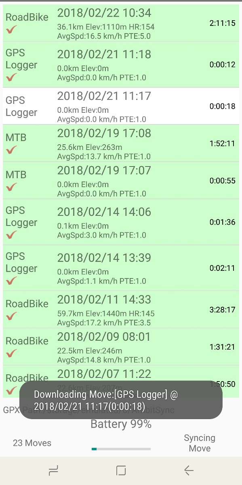
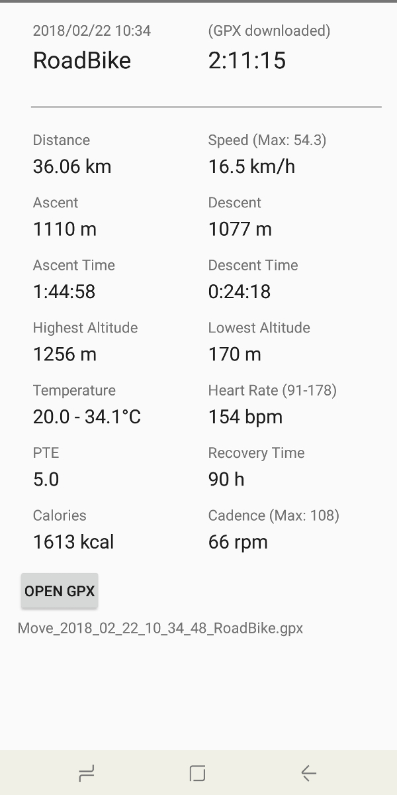
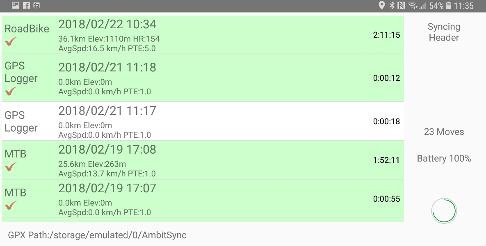
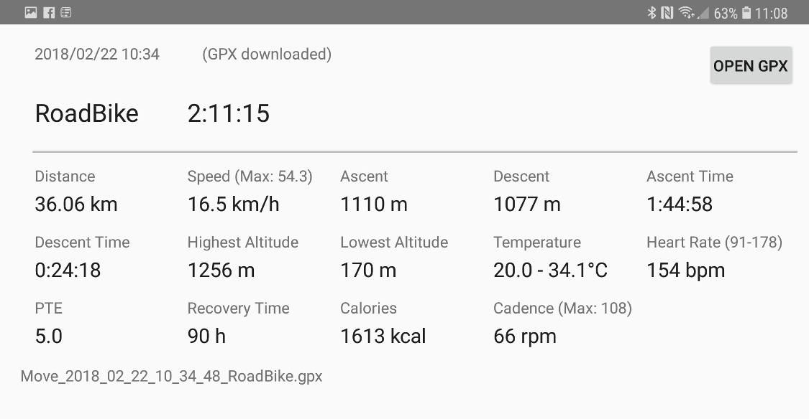

# AmbitSync

Ever think about viewing your workout result using Strava or other similar services/app when you just finish it somewhere without your PC?

[](https://f-droid.org/packages/idv.markkuo.ambitsync/)
[](https://play.google.com/store/apps/details?id=idv.markkuo.ambitsync)

AmbitSync is an Android app to download sport logs (or "moves") from Suunto Ambit GPS watches and convert them to GPX file right on your Android device through the USB cable.

The app uses the excellent libambit (from [openambit](https://github.com/openambitproject/openambit)) to download "Moves" by the USB host controller on Android. It then converts to GPX format and save to your Android device's storage, which can later be mapped/analysed by other apps or services. 

**screenshot**












## Limitations

Ambit watch support is provided solely by the awesome [openambit project](https://github.com/openambitproject/openambit). If your watch is supported by openambit, it should work here. No functional change is made in the underlying libambit except for a minor change to support Android. See below for changes made on libambit. 

AmbitSync does read-only access from your watch and converts them into GPX format following a simple algorithm (see below "GPX conversion" section). **It doesn't "sync" to Movescount website at all, nor does it make any query from Movescount.** The app simply doesn't require network access.


## Tested devices

Currently I have successfully run the app on the following devices:
- Samsung S8 (Android 7.0 and 8.0)
- Google Pixel 2 XL (Android 8.0 and 8.1)
- HTC one custom ROM (Android 6.x)
- Google Nexus 5 (Android 6.0.1)

Some people also report success with other phones. Devices with Android 4.2+ (API 17) and usb host mode should be able to run this app.

I use my Ambit 2 to test.


## How to run

Sync the project, import it using Android Studio 3.0+ (I'm using 3.0.1 as of now) and build the apk.

Or use the app/release/app-release.apk in project and copy it to your device to install, or use adb:
```adb install -r app/release/app-release.apk```

Or simply get it on [google play](https://play.google.com/store/apps/details?id=idv.markkuo.ambitsync)


## Technical details

For developers:

### GPX conversion

The app implements a simple GPX conversion algorithm after downloading internal Ambit log samples:
1. Reorder the samples by time:
   a. Put 'Position' type related samples at first
   b. then there comes the 'Periodic' type samples.
2. Loop through the re-ordered samples
   a. Whenever there is a Periodic sample, read some important values (elevation, hr, cadence etc) into an ArrayList
   b. Whenever there is a Position/GPS sample which always comes with GPS lat/lon information, create a <trkpt> element, and save those values to the trkpt by averaging them
3. No Lap information is saved. There is always a single trkseg element in the outputed GPX.


### Android's restriction on native USB device access

The app requires USB host controller to be present on the Android device to work. libambit (the library to communicate with Ambit watches) also depends on hidapi and libusb library to access the connected USB device (Ambit watch). 

On Android OS a regular user (non-rooted device) has some limitation on the USB system, which can limit the permission to access the Ambit watch. Those include:
1. a regular user is normally not allowed to browse through USB sysfs (/sys/bus/usb/devices).
2. in native layer it's not possible to "open" a USB device and get a file descriptor there.

The common pattern here for native layer to access USB devices using libusb is:
1. Use Android API (Java) to request access to the USB device whenever a targeted USB device is attached (use the `getDeviceList()` in `class UsbManager` )
2. after user grants the permission, use Android API to open the device and get a file descriptor(fd) there
3. Through JNI the main process passes the fd and the usbfs path to libusb
4. by using the opened fd, libusb will be able to read/write to the USB device. However, it won't be able to enumerate all connected device and will only work through the fd and usbfs path. 


### Modification to libambit and hidapi:

To make the communication to USB device possible using libusb, modification has been made in libambit, hidapi and libusb. For libusb, an excellent work is [add Android 5-7 support, pull request #242 for libusb](https://github.com/libusb/libusb/pull/242). AmbitSync has direct use of these patches to make libusb support Android.

hidapi changes:
1. hid_enumerate() now uses libusb_wrap_fd() without enumerating all USB devices. It will check for VID/PID for the correct device to access
2. hid_open_path() now also uses libusb_wrap_fd() without enumerating all USB devices. 

libambit changes:
1. add android_def.h for some missing functions
2. change debug.c to output log to Android log (logcat)
3. device_driver_ambit.c: add additional progress report when reading header
4. fixing some compilation issues on Android: pmem20.c and protocol.c
5. libambit.c: 
   - libambit_set_device(): used by Java to set the USB fd and path to the library
   - libambit_create(): used by Java to initialise Ambit device based on VID/PID

### Native code limitation

The app currently builds as 32bit only because when building for 64bit, libusb doesn't behave well (configuration descriptor always has short read: 
```libusb  : [ 0.003209] [00006232] libusb: warning [parse_interface] short extra intf desc read 23/41)```

And I didn't have time to pull all latest changes from libusb to see if this goes away. Anyway by setting gradle's ABI filter to "armeabi-v7a" to limit to 32bit build, the issue isn't observed.


### Further work

AmbitSync is written in Java with a libambitsync library written in C to help with JNI between Java and libambit. Most of the log sample implemented in libambit is modeled in Java as well (except for some new additions to libambit). Openambit has implemented full sync with Movescount to make the best of those downloaded log samples. This app doesn't. 

For those interested one can re-write in Java or modify Qt C++ codes from openambit and make it fully functional with Movescount. This app only reads the log and does a simple conversion to GPX, which suits my needs. I always can't wait to get back home with my computer to sync those moves and map them. With this app I can do it when I am still away with only my phone. 

The `AmbitRecord` class holds everything read from Ambit watch and it is `Parcelable`. Incomplete `toJson()` implementation is also there.


### Project TODO list

- Add Strava upload support (7.3.2018)
  - strava upload has been implemented as of now. UI isn't good though. Should work on it some day.

- More move type tests:
  - only some basic GPS based move types are tested: "cycle", "treking", "run" etc. 


### Debugging

Logcat TAG filter: 

```adb logcat 'libambit:* AmbitSync:* AmbitMoveInfo:* AmbitRecord:* AmbitLogEntry:* AmbitGPXWriter:* LogSample:* PeriodicLogSample:* libusb:* *:S'```

(note: lots of verbose level log. You may want to use *:D instead for those tags)

GPX file validator:

```xmllint --noout --schema http://www.topografix.com/GPX/1/1/gpx.xsd test.gpx```


### Library & Reference

- [openambit](https://github.com/openambitproject/openambit)

- [hidapi](http://github.com/signal11/hidapi)

- [hidapi on Android](https://github.com/Senseg/android_external_hidapi)

- [libusb](https://github.com/libusb/libusb)

- [add Android 5-7 support, pull request #242 for libusb](https://github.com/libusb/libusb/pull/242)

- [libiconv with Android.mk](https://github.com/ironsteel/iconv-android)

- [Android Ambit](https://github.com/uvwxy/android-ambit)

- [StravaZpot-Android](https://github.com/SweetzpotAS/StravaZpot-Android)


### License

The app uses the following main libraries:
- openambit: GPLv3
- hidapi: GPLv3, BSD, or original hidapi license
- libusb: LGPL v2.1
- iconv: GPLv3
- StravaZpot: Apache License v2

So the project is released under GPLv3 as well.

